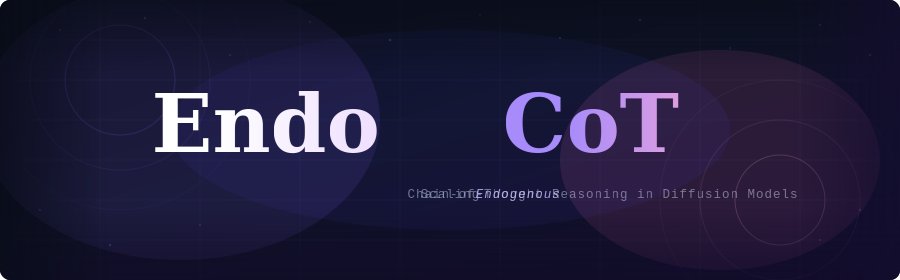
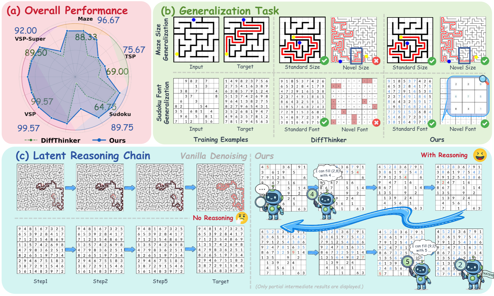
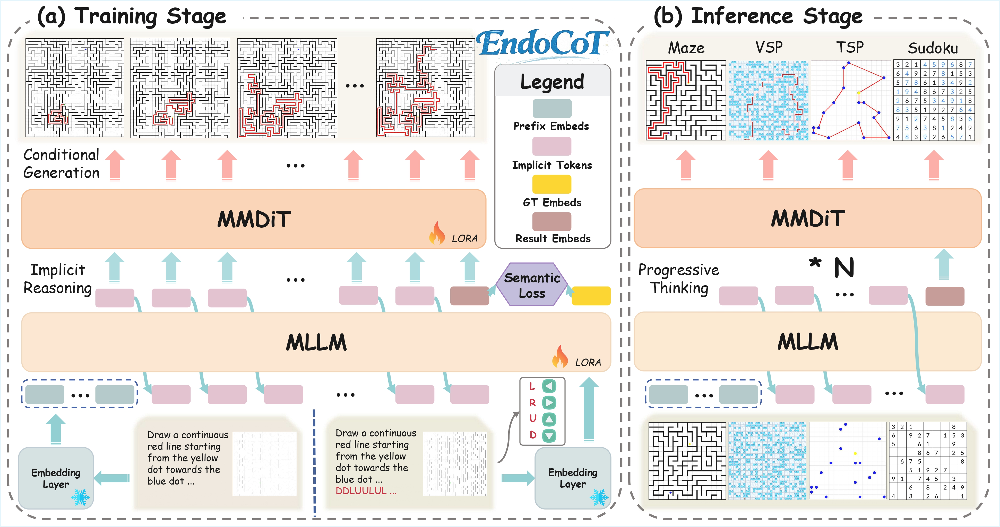
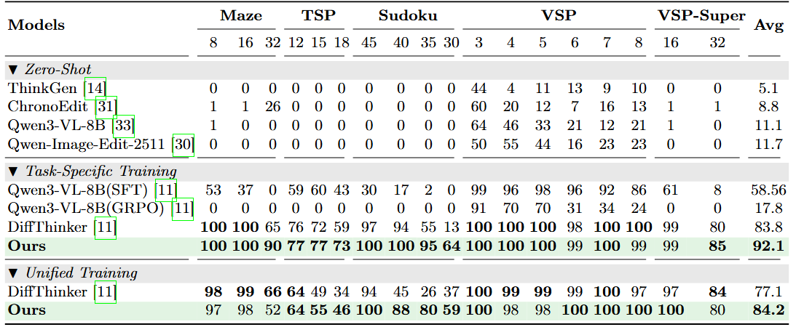
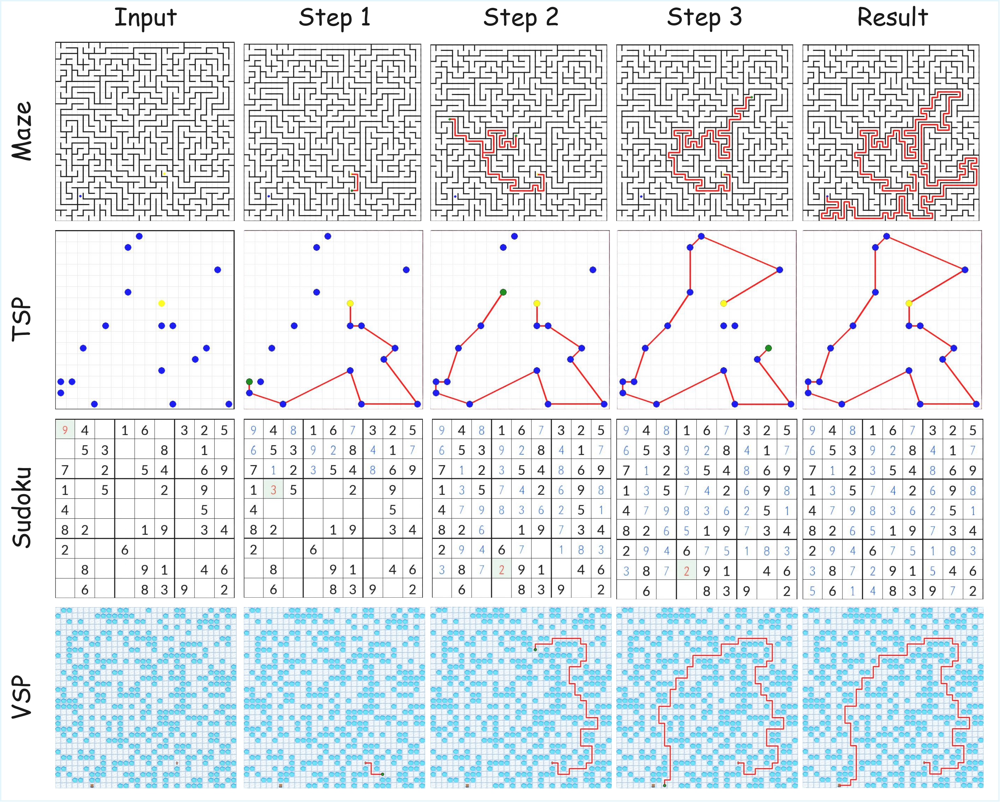

<p align="center">    </p>

<p align="center">
  <a href="https://github.com/InternLM/EndoCoT"></a>
  <a href="https://github.com/InternLM/EndoCoT/forks"></a>
  <a href="https://github.com/InternLM/EndoCoT/issues"></a>
  <a href="https://github.com/InternLM/EndoCoT/blob/main/LICENSE"></a>
  <br>
  <a href="https://arxiv.org/abs/xxxx.xxxxx"></a>
  <a href="https://lennoxdai.github.io/EndoCoT-Webpage/"></a>
  <a href="https://huggingface.co/internlm/EndoCoT"></a>
  <a href="https://huggingface.co/datasets/internlm/EndoCoT-Data"></a>
  <br>
  <br>
  
</p>


# EndoCoT: Scaling Endogenous Chain-of-Thought Reasoning in Diffusion Models

## 📝TODO

- [x] Open source the training code
- [x] Open source the training data
- [x] Open source the main task ckpt
- [ ] Open source the edit model ckpt
- [ ] Refactor the codebase for better usability and maintainability

## 📰News

- 🚀 [2025/11/02] We have released the EndoCoT [repository]([InternLM/EndoCoT](https://github.com/InternLM/EndoCoT)).

## 🌟Highlight



- EndoCoT is a reasoning paradigm for diffusion models that enables step-by-step inference. It outperforms conventional training methods on Qwen-Image-Edit-2511.



- And provide transparent, intermediate reasoning trajectories.



## ⚡Quick Start

### Setup environment

```bash
git clone https://github.com/InternLM/EndoCoT
cd EndoCoT
conda create -n EndoCoT python=3.10
conda activate EndoCot
# Please install the version of torch compatible with your machine.
pip install -r requirements.txt
# Please install the version of vLLM compatible with your machine.
```

### Inference

1. Download the ckpt:

   - You may find our pretrained weights at: [**EndoCoT**](https://huggingface.co/InternLM/EndoCoT)

   >  Following the configuration of *[**Diffthinker**](https://github.com/lcqysl/DiffThinker)*, we provide a customized checkpoint for **Qwen-Image-Edit**. This checkpoint has been merged from the original `safetensors` to ensure compatibility with*[**Diffsynth-Studio**](https://github.com/modelscope/DiffSynth-Studio)* training. Please use the checkpoint provided in this repository instead of the official version for correct loading and inference.

2. Test Single Case

   ```bash
   cd test
   python test.py \
       --task Maze \
       --model_root /path/to/merged_ckpts \
       --lora_path /path/to/your_lora_weight.safetensors \
       --input_image ./data/sudoku_sample.png \
       --output_dir ./outputs/sudoku_results
   ```

3. Eval Our Ckpt

   > We follow the exact same setting as *[**Diffthinker**](https://github.com/lcqysl/DiffThinker)*

   ```bash
   cd Maze
   bash eval/gen_and_parse.sh
   bash eval/eval_path.sh
   ```

### Training

1. Download the datasets & metadata.csv

   - You may find our training data at: [**EndoCoT dataset**](https://huggingface.co/datasets/InternLM/EndoCoT)

   > Since the metadata uses relative paths, please ensure the dataset files are placed in the same directory as `metadata.csv`

2. Train your model

   ```bash
   cd DiffSynth-Studio
   bash add/Maze/stage1.sh
   python change_ckpt_prefix.py --src /path/to/the/Maze/save/dir/Maze_stage1	
   bash add/Maze/stage2.sh
   python change_ckpt_prefix.py --src /path/to/the/Maze/save/dir/Maze_stage2
   ```

### How to change the latent reasoning steps?

> **Note on Customization:** Since the current implementation is straightforward, you can only manually adjust the latent reasoning steps in `DiffSynth-Studio/diffsynth/pipelines/qwen_image.py`:
>
> - **Line 442:** Modify `infer_steps`.
> - **Line 471:** Modify `training_steps`.
>
> ##### **We plan to optimize this in future releases.**

```python
def encode_prompt_edit(self, pipe: QwenImagePipeline, prompt, edit_image, is_final, gt_prompt=None, idx=None):

        drop_idx = 64
        if type(prompt[0])==str:
            template =  "<|im_start|>system\nDescribe the key features of the input image (color, shape, size, texture, objects, background), then explain how the user's text instruction should alter or modify the image. Generate a new image that meets the user's requirements while maintaining consistency with the original input where appropriate.<|im_end|>\n<|im_start|>user\n<|vision_start|><|image_pad|><|vision_end|>{}<|im_end|>\n<|im_start|>assistant\n"
            txt = template.format(prompt[0])
            model_inputs = pipe.processor(text=txt, images=edit_image, padding=True, return_tensors="pt").to(pipe.device)
            embedding_layers = pipe.text_encoder.model.language_model.get_input_embeddings()
            with torch.no_grad():
                inputs_embeds = embedding_layers(model_inputs.input_ids)
            self.attention_mask = model_inputs.attention_mask
            self.pixel_values = model_inputs.pixel_values
            self.image_grid_thw = model_inputs.image_grid_thw
        else:
            inputs_embeds= prompt[0]
            
        # dxl: test use
        if is_final==None or idx!=None:
            print("现在在inference。或者stage2训练")
            if idx!=None:
                iter_times = idx-2
            else:
                # infer step
                iter_times = 50
                
            with torch.no_grad():
                inputs_embeds = self.manual_generate_eval(
                    pipe, 
                    inputs_embeds=inputs_embeds,
                    max_new_tokens=iter_times,
                ).detach()
            
            # dxl: only update the last 2 tokens
            if idx!=None:
                inputs_embeds = self.manual_generate_eval(
                    pipe,
                    inputs_embeds=inputs_embeds,
                    max_new_tokens=2,
                )

            generated_embeds = inputs_embeds

		... ... 
        
        # dxl：training
        if is_final!=None and idx==None:
            try:
                generated_embeds, _ = self.manual_generate(
                    pipe,
                    inputs_embeds=inputs_embeds,
                    is_final=is_final,
                    # training steps
                    max_new_tokens=2,
                )
            except Exception as e:
                print(f"Error!: {type(e).__name__} - {e}")
                print(inputs_embeds.shape)
                assert False

        try: 
            return split_hidden_states, generated_embeds, eos_loss
        except:
            print(f"[WARNING] Prompt was not updated correctly for inference.")
            return split_hidden_states
```

## 📖 Citation

```

```

## ⚖️ License

  
